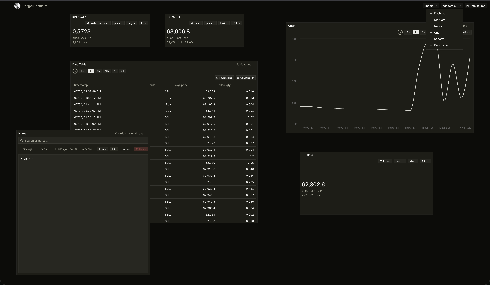

# PargalıIbrahim Canvas

Raw trading terminal shell — draggable widget grid, shadcn/ui themes, layout persistence, and a local **Parquet data backend**. Clone it as a starting point for research, analytics, charting, dashboards, trade UI, or bot front-ends.



## What you get

| Area | Details |
|------|---------|
| **Grid** | Drag, resize (8 handles), overlap/stack with z-index; multiple instances per widget |
| **Backend** | FastAPI + DuckDB — flat `.parquet` files and nested **streams** (`trades`, `prediction_price`, …) |
| **Widgets** | Data Table, Chart, KPI Card, Dashboard, Reports (preview), Notes |
| **Data binding** | Per-widget dataset, columns, time range (`15m`–`7d`), KPI metric + aggregation |
| **Themes** | 5 shadcn presets — Neutral, Stone, Mauve, Taupe, Olive |
| **Persistence** | Workspace layout + widget config in `localStorage` |

**Stack:** Vite · React 19 · TypeScript · Tailwind v4 · shadcn/ui · react-grid-layout v2 · FastAPI · DuckDB

## Quick start

### 1. Frontend

```bash
git clone https://github.com/0xanrelins/Pargali-ibrahim-Canvas.git
cd Pargali-ibrahim-Canvas
npm install
npm run dev
```

Open [http://localhost:5173](http://localhost:5173).

### 2. Backend (Parquet data)

```bash
cd backend
python3 -m venv .venv
source .venv/bin/activate   # Windows: .venv\Scripts\activate
pip install -r requirements.txt
python scripts/generate_sample.py   # optional — writes data/sample/market_ticks.parquet
uvicorn app.main:app --reload --port 8000
```

### 3. Connect data in the UI

**Data source** → set your Parquet folder (absolute path, e.g. `…/data/sample` or your own library) → **Save**.

Vite proxies `/api` → `http://127.0.0.1:8000`. Then open a **Data Table** or **Chart**, pick a dataset, and explore.

## Documentation

| Guide | Description |
|-------|-------------|
| [docs/README.md](docs/README.md) | Documentation index + typical workflows |
| [docs/WIDGET-GUIDE.md](docs/WIDGET-GUIDE.md) | Add widgets, wire live data, formatters |
| [docs/THEME-GUIDE.md](docs/THEME-GUIDE.md) | Themes, tokens, shell rules |
| [backend/README.md](backend/README.md) | API reference — preview, series, KPI, time range |
| [docs/NEXT-STEPS.md](docs/NEXT-STEPS.md) | Roadmap |
| [AGENTS.md](AGENTS.md) | Architecture + AI agent conventions |

## Project layout

```
src/
  App.tsx                  Shell, grid, header
  panels.ts                Widget catalog + instance ids
  context/ParquetDataContext.tsx
  api/client.ts            Backend client
  *Panel.tsx               Widget bodies
backend/
  app/                     FastAPI + DuckDB
  scripts/generate_sample.py
docs/                      Guides (see docs/README.md)
```

## Key files

| File | Role |
|------|------|
| `src/layoutStorage.ts` | Workspace layout persistence |
| `src/datasetStorage.ts` | Per-widget dataset + column defaults |
| `src/timeRangeStorage.ts` | Per-widget time range |
| `src/kpiStorage.ts` | KPI metric + aggregation per widget |
| `backend/.canvas-state.json` | Parquet folder path (gitignored) |

## License

MIT — see [LICENSE](LICENSE). Personal and commercial use allowed; no warranty.
