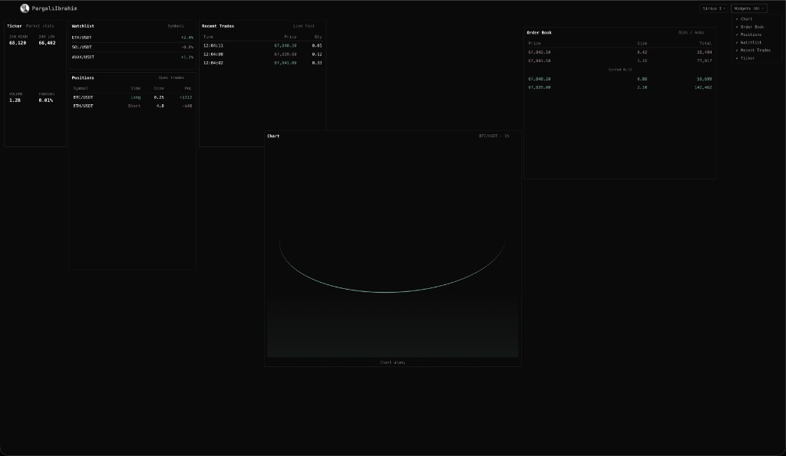

# PargalıIbrahim Canvas

Raw trading terminal shell — draggable widget grid, themes, and layout persistence. No live data, no exchange integration. Use it as a starting point for your own research, analytics, charting, table dashboards, trade UI, or bot front-end.

## Example

Sirius I theme, all 6 widgets open — placeholder data, ready to replace with your feeds:



## What you get

- **Widget grid** — drag, resize (8 directions), overlap/stack with z-index
- **6 placeholder widgets** — chart, order book, positions, watchlist, trades, ticker
- **3 themes** — Dark, Light, Sirius I (default)
- **Layout persistence** — workspace saved in `localStorage` (lg breakpoint)
- **Responsive** — lg / md / sm breakpoints; md/sm auto-stack from lg order

Stack: Vite, React 19, TypeScript, `react-grid-layout` v2.

## Quick start

```bash
git clone git@github.com:0xanrelins/Pargali-ibrahim.git
cd Pargali-ibrahim
npm install
npm run dev
```

Open `http://localhost:5173`. Pick widgets and theme from the header dropdowns.

## Customize

| Task | Guide |
|------|-------|
| Add or change widget content | [docs/WIDGET-GUIDE.md](docs/WIDGET-GUIDE.md) |
| Add or change a theme | [docs/THEME-GUIDE.md](docs/THEME-GUIDE.md) |
| AI / agent context | [AGENTS.md](AGENTS.md) |

Typical workflow:

1. Wire real data (WebSocket, REST) into `PanelContent.tsx` per widget `kind`
2. Add widgets in `src/panels.ts` and new `case` branches in `PanelContent.tsx`
3. Adjust colors in `src/index.css`; shell overrides in `src/App.css`
4. Rebrand header logo/text in `src/App.tsx` and `public/`

## Key files

| File | Role |
|------|------|
| `src/App.tsx` | Shell, grid, header |
| `src/panels.ts` | Widget catalog, min sizes, default layout |
| `src/PanelContent.tsx` | Widget body (replace placeholders with your data) |
| `src/layoutStorage.ts` | Workspace persistence |
| `src/themeStorage.ts` | Theme IDs + localStorage |
| `src/index.css` | Theme CSS variables |
| `src/App.css` | Shared component styles |

## License

MIT — see [LICENSE](LICENSE). Personal and commercial use allowed; no warranty.
