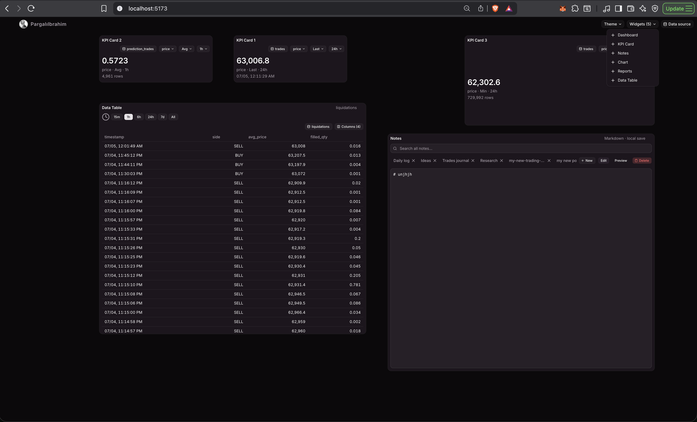

# Documentation

Guides for customizing and extending PargalıIbrahim Canvas.

## Screenshots

Live Parquet data — KPI cards, chart, data table, notes (Mauve theme):


Running locally at `localhost:5173` with the widget picker:



## Start here

| Guide | What it covers |
|-------|----------------|
| [../README.md](../README.md) | Overview, quick start (frontend + backend) |
| [WIDGET-GUIDE.md](./WIDGET-GUIDE.md) | Add widgets, wire Parquet data, per-instance state |
| [THEME-GUIDE.md](./THEME-GUIDE.md) | Color themes, shadcn tokens, shell rules |
| [../backend/README.md](../backend/README.md) | FastAPI + DuckDB API, streams, KPI, time range |
| [NEXT-STEPS.md](./NEXT-STEPS.md) | Roadmap — done vs remaining |
| [../AGENTS.md](../AGENTS.md) | AI agent context, architecture, conventions |

## Typical workflows

**Load your data**

1. Start backend → `uvicorn app.main:app --reload --port 8000`
2. Start frontend → `npm run dev`
3. **Data source** → absolute path to your Parquet folder → Save

**Build a workspace**

1. Open **Data Table** → pick dataset + columns (saves workspace defaults)
2. Add **Chart**, **KPI Card**, or **Dashboard** — each instance has its own dataset and time range
3. Drag, resize, stack panels — layout persists in `localStorage`

**Extend the shell**

- New widget → `panels.ts` + panel component + `PanelContent.tsx` ([WIDGET-GUIDE](./WIDGET-GUIDE.md))
- New theme → `index.css` + `themeStorage.ts` ([THEME-GUIDE](./THEME-GUIDE.md))
- New API endpoint → `backend/app/` ([backend README](../backend/README.md))

## Widgets at a glance

| Widget | Live data | Notes |
|--------|-----------|-------|
| Data Table | Parquet preview | Column picker, workspace defaults |
| Chart | Line series | Per-widget dataset + time range |
| KPI Card | `/kpi` API | Metric, aggregation, range dropdown |
| Dashboard | KPI + chart + table | Combined panel |
| Reports | Preview tab | Export mock; saved queries planned |
| Notes | localStorage | Markdown edit + preview |

## Data layout

```
your-data-folder/
├── market_ticks.parquet      # flat file dataset
├── trades/                   # stream (nested parquet)
│   └── **/*.parquet
└── prediction_price/
    └── **/*.parquet
```

Streams are auto-discovered as top-level subfolders with parquet files inside.
